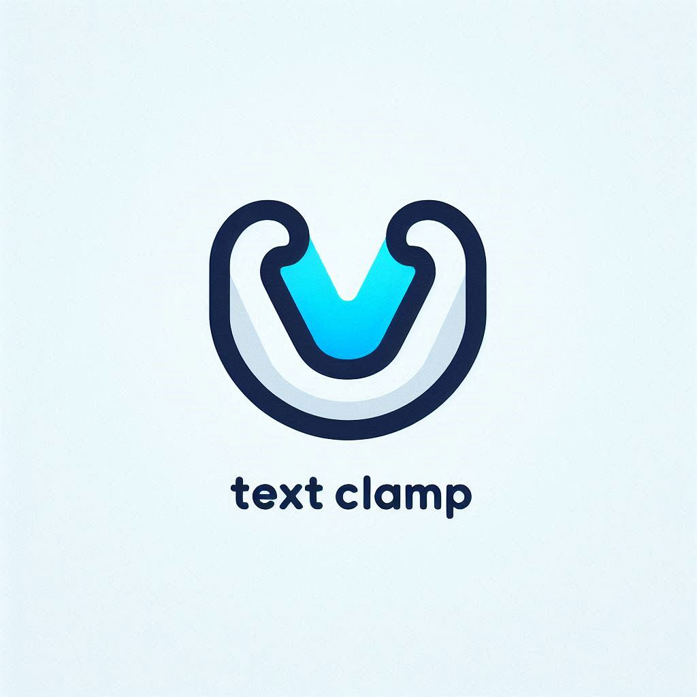

# TextClamp for Vue 3.0

<p align="center">
  
</p>

<p align="center">
  <a href="./README.md" id="en-link">English</a> | <a href="./README.zh-CN.md" id="zh-link">中文</a>
</p>

<div id="english-doc">

## Introduction

TextClamp is a lightweight Vue 3 component for elegant text truncation with "expand/collapse" functionality. It provides an intuitive way to handle large blocks of text in your Vue applications.

## Features

- ⚡️ **Lightweight** - Minimal impact on your bundle size
- 🔥 **Simple API** - Just pass your text and go!
- 📐 **Line Control** - Specify exactly how many lines to display
- 🎨 **Customizable Buttons** - Choose button position and style
- 🔄 **Reactive** - Responds to all prop changes in real-time
- 🔍 **Type-safe** - Written in TypeScript for better development experience
- 🧩 **Slot Support** - Customize expand/collapse buttons with slots
- 🎯 **Zero Dependencies** - Uses native browser capabilities

## Installation

```bash
npm install text-clamp-for-vue3
```

## Basic Usage

```vue
<template>
  <TextClamp :text="myText" />
</template>

<script setup>
import { TextClamp } from 'text-clamp-for-vue3';

const myText = "This is a long text that will be truncated...";
</script>
```

## Props

| Prop | Type | Default | Description |
|------|------|---------|-------------|
| `text` | String | **Required** | Text content to display and truncate |
| `lines` | Number | `3` | Number of lines to display before truncation |
| `buttonType` | String | `'tight'` | Button position: `'tight'` (at text end) or `'one-line'` (separate line) |
| `expandText` | String | `'Expand'` | Text for the expand button |
| `collapseText` | String | `'Collapse'` | Text for the collapse button |
| `maxButtonTextLength` | Number | `15` | Maximum length of button text |
| `buttonAlign` | String | `'right'` | Button alignment: `'left'` or `'right'` (only for 'one-line' type) |

## Custom Button Styling

You can customize the expand/collapse button using the `expandButton` slot:

```vue
<TextClamp :text="myText">
  <template #expandButton="{ toggle, isExpanded }">
    <button class="my-custom-button" @click="toggle">
      {{ isExpanded ? 'Show Less' : 'Show More' }}
    </button>
  </template>
</TextClamp>
```

## Examples

### Basic Example
```vue
<TextClamp :text="myText" />
```

### Custom Line Count
```vue
<TextClamp :text="myText" :lines="2" />
```

### One-line Button
```vue
<TextClamp :text="myText" buttonType="one-line" />
```

### Custom Button Text
```vue
<TextClamp 
  :text="myText" 
  expandText="Read More" 
  collapseText="Read Less" 
/>
```

### Custom Button Alignment
```vue
<TextClamp 
  :text="myText" 
  buttonType="one-line"
  buttonAlign="left"
/>
```

## Browser Support

TextClamp works in all modern browsers that support Vue 3:

- Chrome
- Firefox
- Safari
- Edge

## License

[MIT](LICENSE)

</div>

